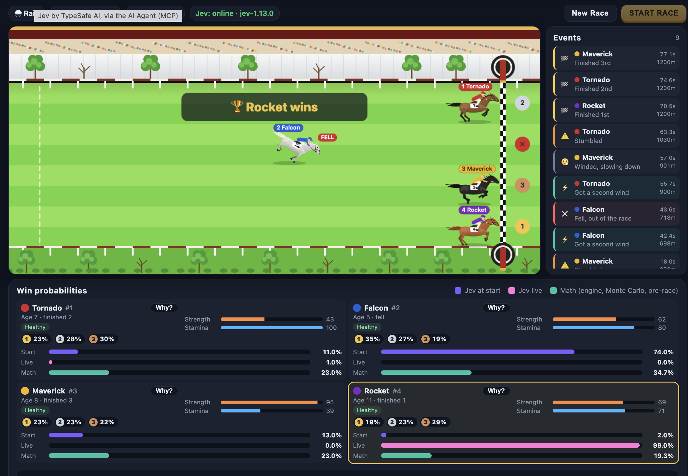

# Horse Racing AI

Horse racing simulator with real-time AI prediction. The TypeSafe Jev model is used to predict race changes in under a second.

Jev predicts live. JavaScript decides.



Jev is the System One model by [TypeSafe AI](https://typesafe.ai). It is the only prediction model in the project: the agent sends it the race state and one typed question "which horse wins", Jev returns a probability per horse. Jev is asked before the start and again during the race, then both answers are compared with the result.

## Stack

- **Frontend** (`frontend/`): React, TypeScript, Vite, Canvas, nginx
- **Jev AI Agent** (`mcp/`): Python, FastMCP, Pydantic, uvicorn, TypeSafe SDK
- **Tests**: pytest
- **Run**: Docker Compose

## Flow

1. The frontend generates a race (`generateRace` in `src/lib/engine.ts`).
2. Start: the frontend calls `predict_race` with the public briefing (weather, distance, horses, rules in plain text). Jev returns pre-race win probabilities.
3. Live: while the race runs, every 700 ms (as often as latency allows once the leader passes 85%) the frontend builds a snapshot (`liveSnapshot`: distance run, observed pace over the last 2 s, finish places, falls, visible incidents with time and place) and calls `predict_race` with the briefing and the snapshot. One request at a time; updates stop when the winner crosses the line.
4. The JS engine decides the winner. The UI compares Jev at start with Jev at end (the last live update before the finish): favorite, probability on the winner, Brier score. The chart shows how Jev moved during the race.

Jev never sees engine internals: no formula, no energy, no form, no result.

The Model Lab asks Jev twice per race: at the start and live when the leader has covered 75% of the distance, via `predict_races`.

## Run

Requirements: Docker with Docker Compose, make.

1. Check that Docker is running:

```
docker info
```

2. Set the TypeSafe API key (early access, console.typesafe.ai):

```
cp mcp/.env.example mcp/.env
```

Put the key into `TYPESAFE_API_KEY=` in `mcp/.env`. Without the key the agent starts, `/health` returns `"configured": false` and the tools return an error.

3. Start the stack:

```
make up
```

The frontend runs on port 3000 or the next free port, the URL is printed after start. AI Agent: `http://127.0.0.1:8765/mcp`, health check `/health`. Another start port: `make up DOCKER_FRONTEND_PORT=4000`.

Other commands: `make down` (stop), `make restart`, `make logs`, `make ps`, `make docker-test` (tests in Docker).

## MCP tools

`predict_race(weather, distance, horses, rules?, snapshot?)`

- `weather`: `sunny` | `rain` | `mud` | `hot` | `windy`
- `distance`: metres, 100..10000
- `horses`: 2..24 items `{name, strength 0..100, stamina 0..100, age 1..30, diseases: [cold | lameness | fatigue]}`, names unique, diseases unique, no extra fields
- `rules`: up to 50 strings, public race rules in plain text
- `snapshot` (live only): `{elapsed, horses: [{name, status: running | finished | fell, distance_run, place (finished only), speed_mps (running only, observed pace), events: [{type: bad_start | winded | stumble | second_wind, at_s, at_m}]}]}`, same horses as the field

Returns `{model, phase: pre_race | live, confidence, probabilities: {name: p}, favorite}`. Probabilities sum to 1, the output is validated before it is returned.

`predict_races(races)`: list of queries (briefing plus optional snapshot, 1..`JEV_MAX_BATCH_RACES`), Jev calls run in parallel up to `JEV_MAX_CONCURRENCY`, returns `{model, predictions: [...]}` in input order.

Invalid input, a missing key or a TypeSafe API error return a tool error (`isError: true`) with the reason.

What the agent sends to Jev (`providers/state.py`): the rules, the race, the horses and, live, ready standings (position, distance run, remaining, gap to the leader, pace, time to finish at that pace, gain on the leader, incidents with time and place) and the order at current pace. Gaps and positions are computed in code, Jev is weak at comparing numbers. The question is one `Choice` with the horse names as options.

Connect to Claude Code or another MCP client:

```
claude mcp add --transport http jev http://127.0.0.1:8765/mcp
```

## Settings

Environment variables or `mcp/.env` (template: `mcp/.env.example`). Values are validated on startup.

| Variable | Default | Validation |
|---|---|---|
| `JEV_HOST` | `127.0.0.1` | non-empty |
| `JEV_PORT` | `8765` | 1..65535 |
| `JEV_MCP_PATH` | `/mcp` | starts with `/` |
| `JEV_ALLOWED_ORIGINS` | `http://localhost:5173,http://127.0.0.1:5173` | comma-separated, `http(s)://` or `*` |
| `JEV_MAX_BATCH_RACES` | `500` | 1..10000 |
| `JEV_LOG_LEVEL` | `info` | critical, error, warning, info, debug |
| `TYPESAFE_API_KEY` | not set | TypeSafe API key, also `JEV_TYPESAFE_API_KEY` |
| `JEV_TYPESAFE_MODEL` | `jev-latest` | Jev model, pin a version (for example `jev-1.13.0`) for comparable runs |
| `JEV_TYPESAFE_BASE_URL` | SDK default | `http(s)://` |
| `JEV_TYPESAFE_TIMEOUT` | `10` | seconds, 0 < x <= 120 |
| `JEV_MAX_CONCURRENCY` | `4` | 1..64, parallel Jev calls in `predict_races`; TypeSafe limit is 1200 requests per minute |

Frontend agent URL: `VITE_JEV_AGENT_URL` in `frontend/.env` (template: `frontend/.env.example`), default `http://127.0.0.1:8765/mcp`. Vite reads it at build time; in Docker Compose it is the `VITE_JEV_AGENT_URL` build arg of the `frontend` service.

## Tests

Tests do not call TypeSafe: the provider runs against a fake API (`httpx2.MockTransport`).

```
cd mcp
.venv/bin/pip install -e ".[dev]"
.venv/bin/python -m pytest -q
```

## License

MIT, see [LICENSE](LICENSE).
